# README

25/10 crowdsourcing app.

How it works:

## Scenario: Starting a challenge

- When challenge administrator visits www.twentyfiveten.com
- And creates a challenge
- Then they receive a public challenge URL and a private challenge admin URL

### 01 - Homepage

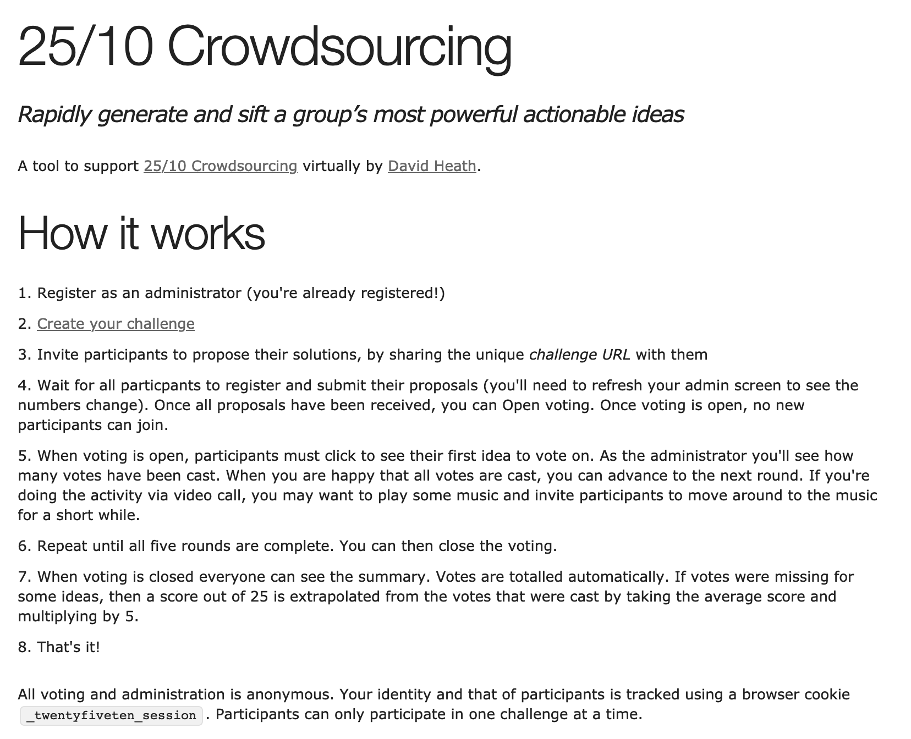

### 02 - New challenge

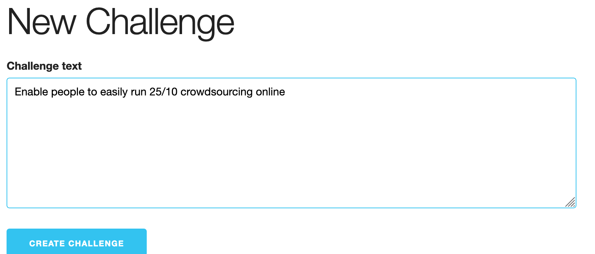

### 03 - list challenges

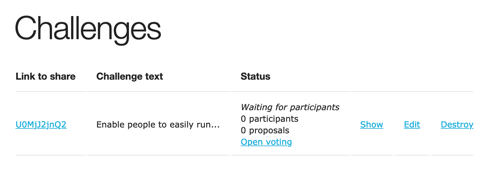

## Scenario: Participating in a challenge

- When a challenge participant visits the public challenge URL
- Then they are shown a holding screen and given a chance to enter their proposed solution

### 04 - participate

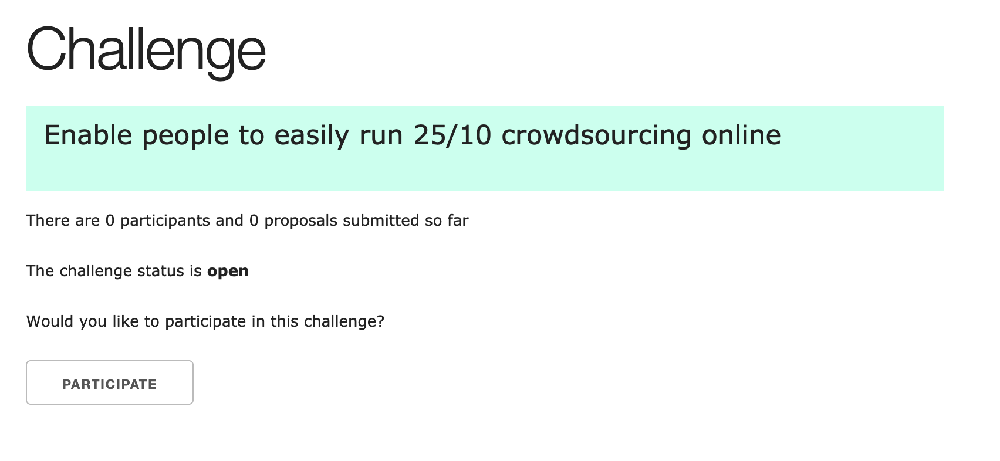

### 05 - Submit idea

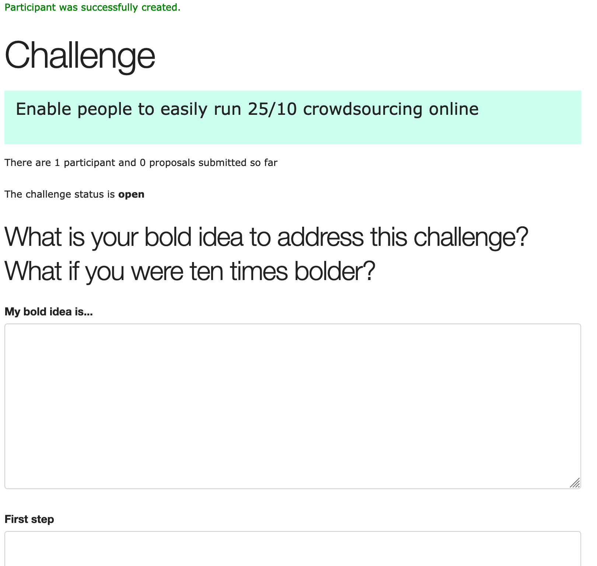

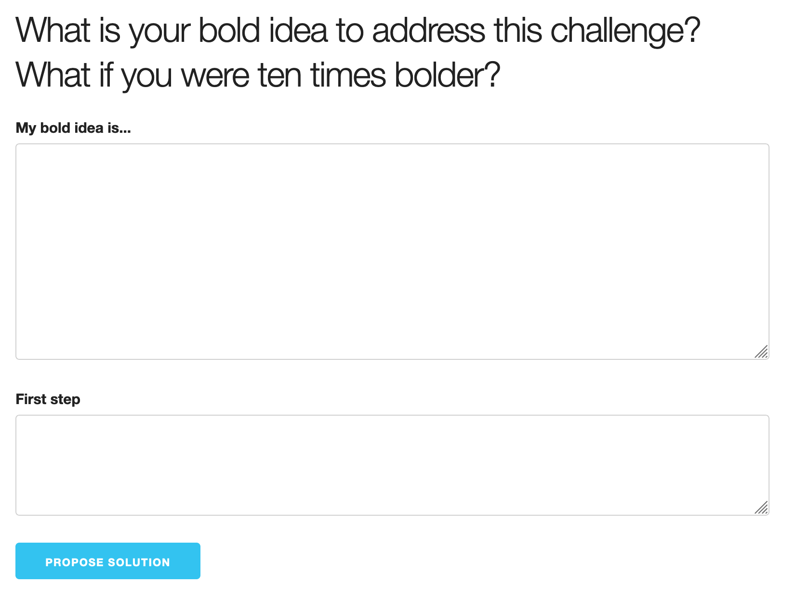

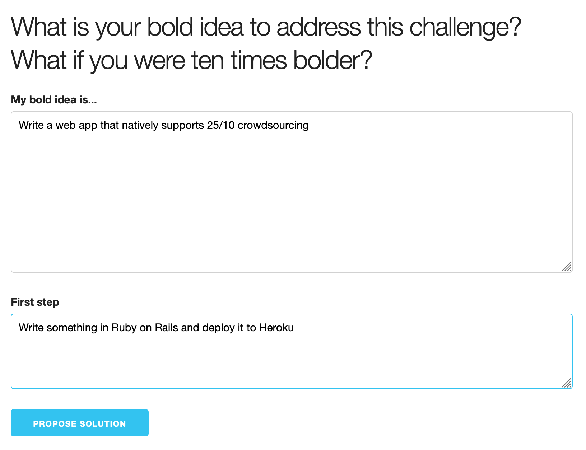

### 06 - idea submitted

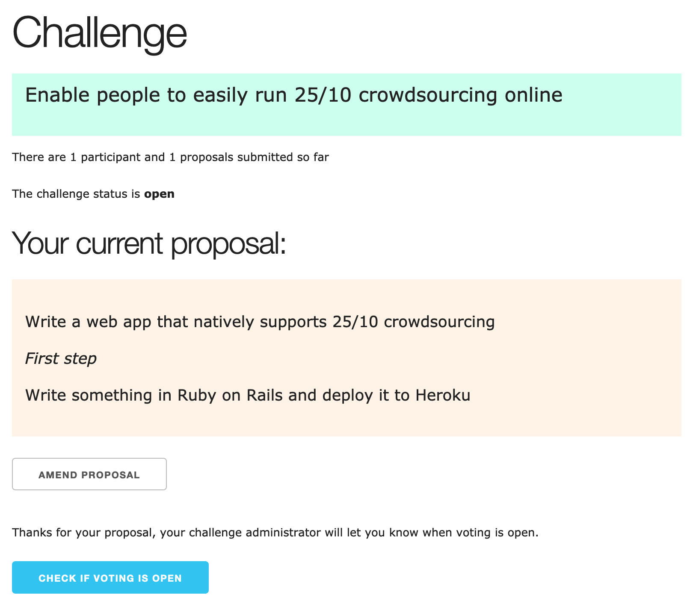

## Scenario: Monitoring proposals

- When a challenge administrator has shared a challenge URL with participants
- And participants have started submitting their proposals
- Then the challenge admininistrator can see how many participants have registered and of those, how many have submitted their proposals

### 07 - admin waiting for participants

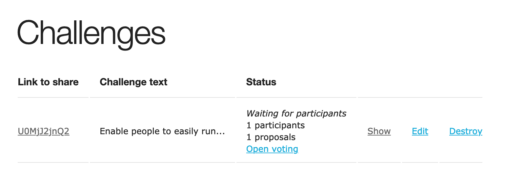

## Scenario: Initiation of voting

- When the challenge administrator is satisfied that all submissions have been received
- And they initiate voting
- Then all participants can start voting on the first round of voting
- And the challenge administrator can see how many votes have been cast for round 1

### 07b - administrator opens voting

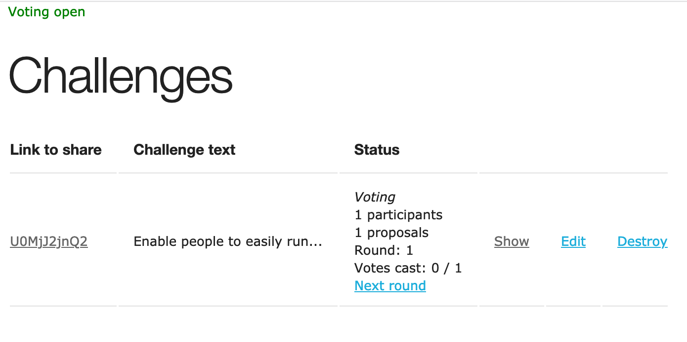

### 08 - participant casts vote

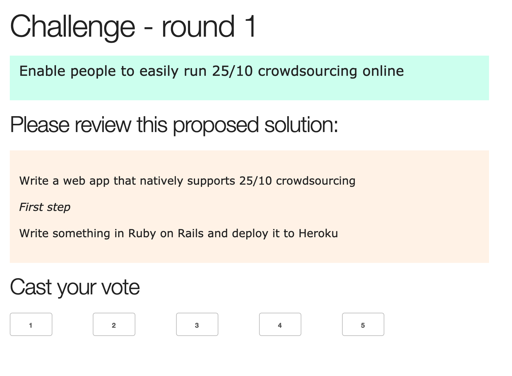

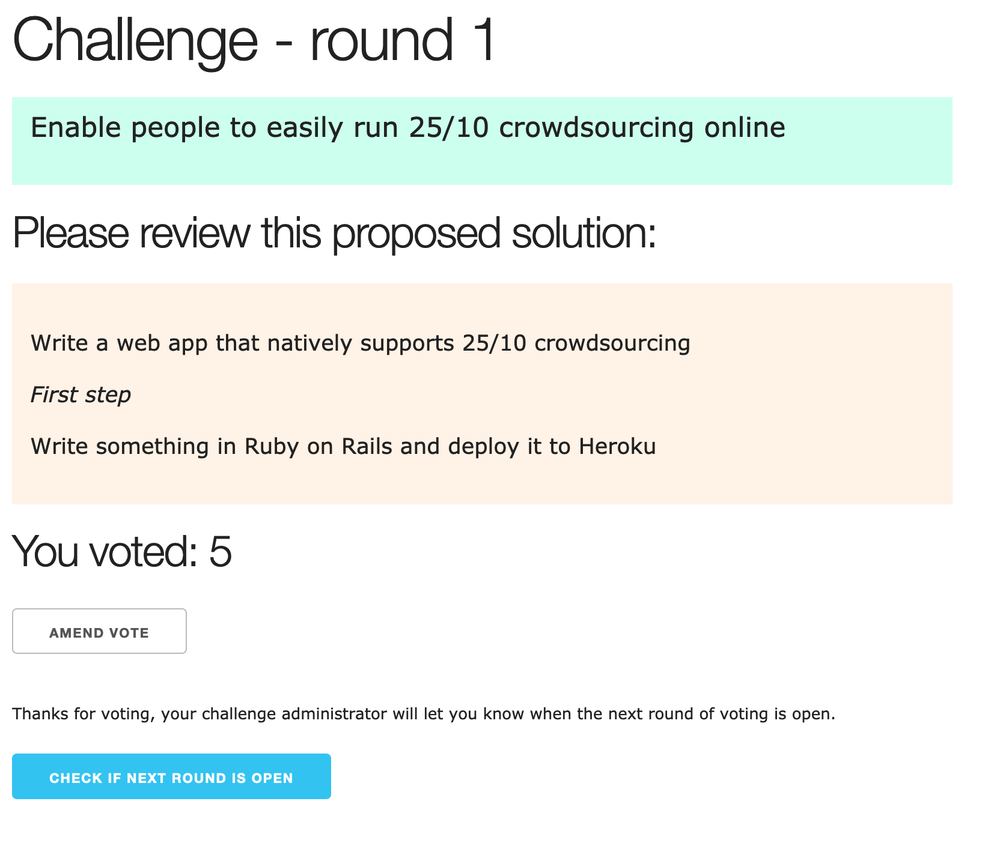

## Scenario: Initiation of subsequent rounds of voting

- When the challenge administrator is satisfied that all votes have been cast for a round
- Then they can initiate the next round of voting
- Then all participants can start voting on the next round of voting
- And the challenge administrator can see how many votes have been cast for that round

### 09 - admin opens next voting round

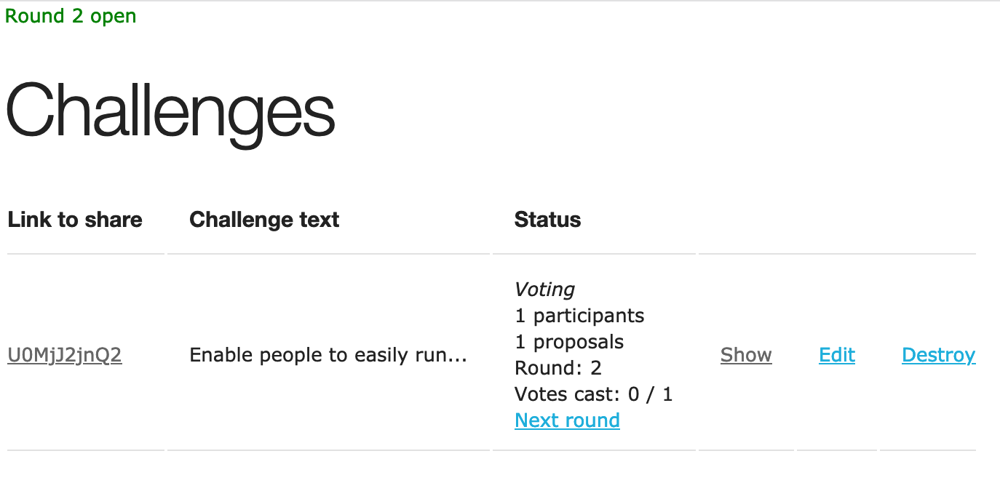

## Scenario: Conclusion of voting

- When a challenge administrator is satisfied that all votes have been cast
- Then they can conclude voting and close the challenge
- And all participants and the challenge administrator can see the challenge and proposed solutions, ordered in descending order of score

### 10 - admin concludes voting

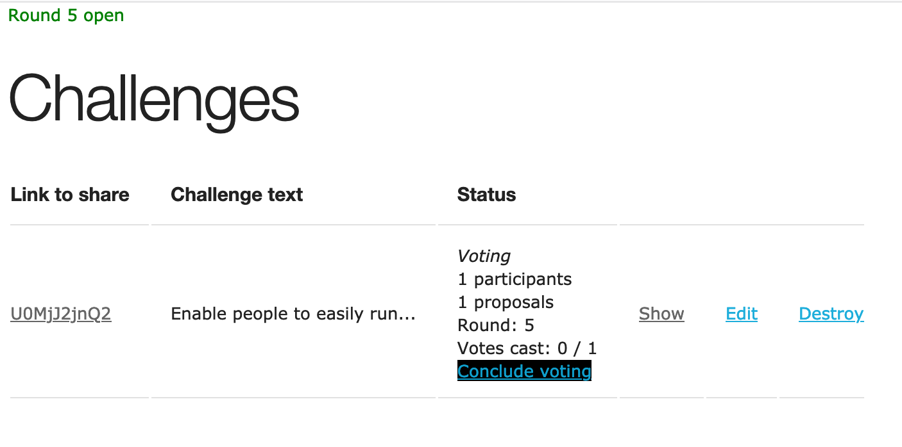

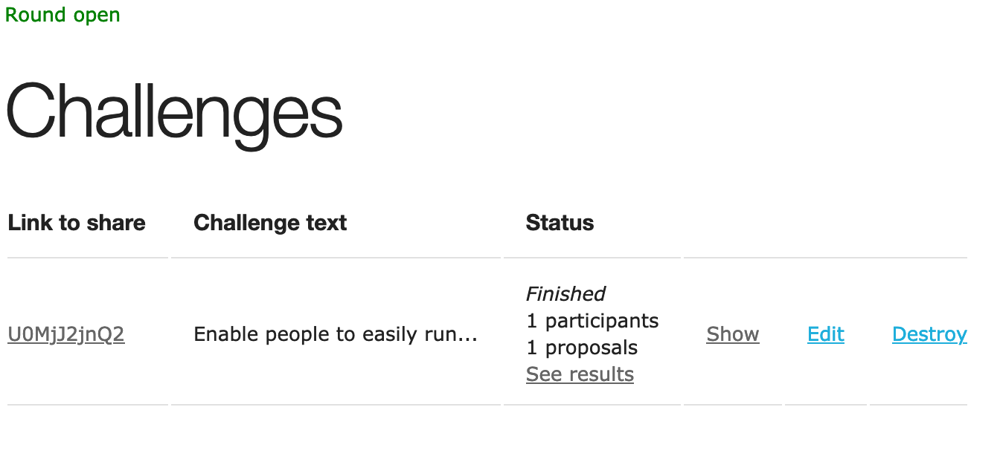

### 11 - summary of results

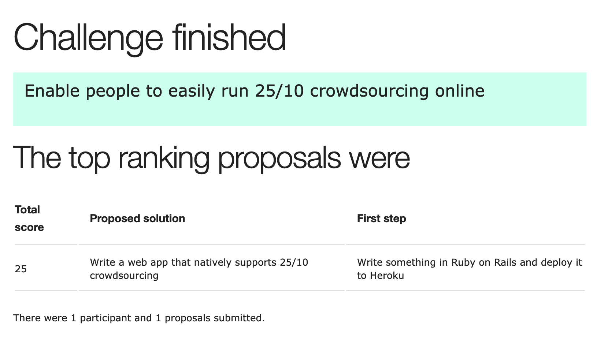

